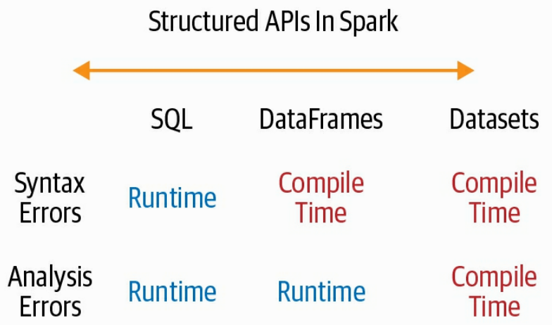
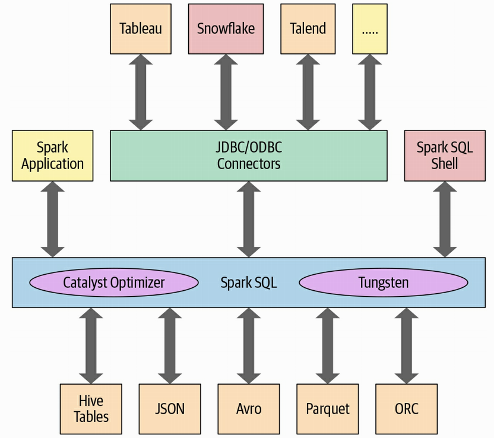
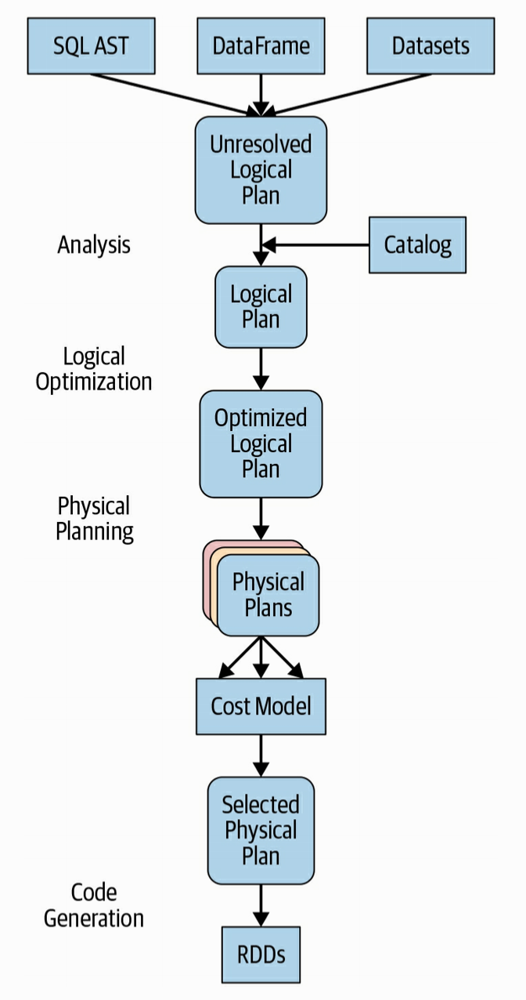

# Learning Spark

## Chapter 1. Introduction to Apache Spark: A Unified Analytics Engine

- reduces the complexity of MR
- less disk I/O, more in memory
- execution plan is an efficient DAG
- code generator produces bytecode running in the JVM, language agnostic
- modularity (varied languages available, 4 typical core modules)
- extensibility (multiple sources and outputs)
- highly fault tolerant
- Catalyst optimizer for SQL
- Tungsten code generator
- Produces RDD (resilient distributed dataset, low level), DataFrames and DataSets (high level abstraction): 3 APIs

### unified analytics: batch, streaming, SQL, and graph

- Spark SQL: build permanent or temp tables
- Spark MLlib (newer spark.ml): build pipelines and persist models
- Spark structured streaming: views a stream as a continuously growing table, can be queried with SQL
- GraphX: PageRank, Connected Components, and Triangle counting

### Distributed execution

- driver program orchestrates parallel execution
- creates a SparkSession to access the executors and cluster manager
- sets JVM parameters
- uses the cluster manager to initiate resources, then communicates directly with them
- SparkSession is now unique entrypoint (no more SQLContext, HiveContext etc)
- context is created automatically when using Spark shell
- cluster manager can be of 4 types: YARN, K8s, standalone and Mesos
- typically one executor per physical node

### YARN

- client or cluster mode (client: driver runs on host, cluster, runs on a node)
- YARN resource manager works with YARN application master to allocate containers on NodeManagers
- Cluster manager YARN RM + AppMaster

### K8s

- driver on a pod
- each worker in a pod
- Cluster manager is K8s master

### Distributed data and partitions

- tries to respect locality
- each partiton is treated like a DataFrame in memory

  ```python
  # make 8 partitions
  log_df = spark.read.text("path_to_large_text_file").repartition(8)
  print(log_df.rdd.getNumPartitions())

  # create a DF of 10k integers and make 8 partitions in memory
  df = spark.range(0, 10000, 1, 8)
  print(df.rdd.getNumPartitions())
  ```

- tune and change partitioning config to use maximum parallelism based on # of cores in executors

## Chapter 2: Getting started

- for python, simply `pip install pyspark[sql,ml,mllib]`
- only set JAVA_HOME in env
- for scripts, set SPARK_HOME in env
- fire up spark shell: `pyspark`
- Spark computations are expressed as operations. These operations are then converted into low-level RDD-based bytecode as tasks, which are distributed to Spark’s executors for execution.
- every computation operates on RDDs, inaccessible to the user, by generating Scala code

### Spark application concepts

- Application: program uses driver and executors
- SparkSession: object which is point of entry to use the API
- Job: parallel computation, multiple tasks
- Stage: job divided in smaller dependent set of tasks
- Task: unit of work sent to executor

#### Spark application and SparkSession

- shell creates the driver which instantiates the SparkSession
- 1 task per core

#### Spark Jobs

- driver converts Spark application to one or more jobs
- each job is transformed into a DAG; each node in the DAG can be one or more stages

#### Spark Stages

- operations that cannot be parallelized run in multiple stages
- stages often delineated on operator's computation boundaries -> data transfer to other executors

#### Spark Tasks

- sub-unit of a Stage
- each task maps to a single core and a single partition

#### Transformations, Actions and Lazy evaluation

- Transformations turn a DF into a new one, without altering the original data (like select, filter, and such)
- Lazy evaluation: results are not computed immediately, but recorded as lineage, which allows for rearranging and optimizing the plan at runtime; computation triggered by actions, not transformations
- fault tolerant as each transformation is recorded in lineage and DFs are immutable between transformations
- example transformations: orderBy, groupBy, filter, select, join
- example actions: show, take, count, collect, save
- Transformations can have narrow or wide dependencies (single partition for input and output, or multiple, inducing shuffling, for instance a sort)

#### The Spark UI

- when launching a shell, part of the output gives the web UI address

#### Standalone app

example, counting items in a CSV file:

```python
# $SPARK_HOME/bin/spark-submit mnmcount.py data/mnm_dataset.csv
import sys
from pyspark.sql import SparkSession

if __name__ == "__main__":
   if len(sys.argv) != 2:
       print("Usage: mnmcount <file>", file=sys.stderr)
       sys.exit(-1)

   spark = (SparkSession
     .builder
     .appName("PythonMnMCount")
     .getOrCreate())
   mnm_file = sys.argv[1]
   mnm_df = (spark.read.format("csv")
     .option("header", "true")
     .option("inferSchema", "true")
     .load(mnm_file))

   count_mnm_df = (mnm_df
     .select("State", "Color", "Count")
     .groupBy("State", "Color")
     .sum("Count")
     .orderBy("sum(Count)", ascending=False))
   count_mnm_df.show(n=60, truncate=False)
   print("Total Rows = %d" % (count_mnm_df.count()))

   ca_count_mnm_df = (mnm_df
     .select("State", "Color", "Count")
     .where(mnm_df.State == "CA")
     .groupBy("State", "Color")
     .sum("Count")
     .orderBy("sum(Count)", ascending=False))
   ca_count_mnm_df.show(n=10, truncate=False)

   spark.stop()
```

- Note: to avoid having verbose INFO messages printed to the console, copy the `log4j.properties.template` file to `log4j.properties` and set `log4j.rootCategory=WARN` in the `conf/log4j.properties file`.
- For Scala, nearly the same, just use sbt first

## Chapter 3: Apache Spark’s Structured APIs

- RDD are dumb, not open to optimization (compute function is opaque to spark, just returns an Iterator[T], no explicit intent, plus generic object in Python)
- DF API allows for much more readable code (not passing lambda functions like in RDD)
- Same API across all languages

### The DataFrame API

- Like distributed in-memory tables with named columns and schemas, columns having a specified data type

- DataFrames are immutable, you change them by creating new ones, lineage is kept

- classic data types, basic and structured

- better to specify a schema upfront than to infer from schema on read

- schemas can be defined in code or in a DSL string

  ```python
  from pyspark.sql.types import *
  schema = StructType([StructField("author", StringType(), False),
      StructField("title", StringType(), False),
      StructField("pages", IntegerType(), False)])
  # or...
  schema = "author STRING, title STRING, pages INT"
  data = [[1, "Jules", "Damji", "https://tinyurl.1", "1/4/2016", 4535, ["twitter",
  "LinkedIn"]], ...
  spark = (SparkSession.builder.appName("Example-3_6").getOrCreate())
  blogs_df = spark.createDataFrame(data, schema)
  ```

- reading from a file (scala version):

  ```scala
  val blogsDF = spark.read.schema(schema).json(jsonFile)
  ```

- operations on columns

  ```scala
  // In Scala
  scala> import org.apache.spark.sql.functions._
  scala> blogsDF.columns
  res2: Array[String] = Array(Campaigns, First, Hits, Id, Last, Published, Url)

  // Access a particular column with col and it returns a Column type
  scala> blogsDF.col("Id")
  res3: org.apache.spark.sql.Column = id

  // Use an expression to compute a value
  scala> blogsDF.select(expr("Hits * 2")).show(2)
  // or use col to compute value
  scala> blogsDF.select(col("Hits") * 2).show(2)

  // Use an expression to compute big hitters for blogs
  // This adds a new column, Big Hitters, based on the conditional expression
  blogsDF.withColumn("Big Hitters", (expr("Hits > 10000"))).show()

  // Concatenate three columns, create a new column, and show the
  // newly created concatenated column
  blogsDF
  .withColumn("AuthorsId", (concat(expr("First"), expr("Last"), expr("Id"))))
  .select(col("AuthorsId"))
  .show(4)

  // These statements return the same value, showing that
  // expr is the same as a col method call
  blogsDF.select(expr("Hits")).show(2)
  blogsDF.select(col("Hits")).show(2)
  blogsDF.select("Hits").show(2)

  // Sort by column "Id" in descending order
  blogsDF.sort(col("Id").desc).show()
  blogsDF.sort($"Id".desc).show()
  ```

- $ before the name of the column which is a function in Spark that converts column named Id to a Column.

- row in Spark is a generic Row object, ordered collection of fields, starting with index 0

- rows can be used to create a DF quickly:

  ```python
  rows = [Row("Matei Zaharia", "CA"), Row("Reynold Xin", "CA")]
  authors_df = spark.createDataFrame(rows, ["Authors", "State"])
  authors_df.show()
  ```

- DataFrameReader and DataFrameWriter to read/write DFs from files from many origins

- Schema inference, speedup:

  ```scala
  val sampleDF = spark
      .read
      .option("samplingRatio", 0.001)
      .option("header", true)
      .csv("/databricks-datasets/learning-spark-v2/sf-fire/sf-fire-calls.csv")
  ```

- if schema isn't inferred but specified:

  ```scala
  sf_fire_file = "/databricks-datasets/learning-spark-v2/sf-fire/sf-fire-calls.csv"
  fire_df = spark.read.csv(sf_fire_file, header=True, schema=fire_schema)
  ```

- create a schema programmatically

  ```python
  from pyspark.sql.types import *
  fire_schema = StructType([StructField('CallNumber', IntegerType(), True),
      StructField('UnitID', StringType(), True),
      ...
  ```

- use DataFrameWriter to save the file, default is Parquet+snappy, schema is saved in files so no need to declare it again for subseqent opens

  ```python
  parquet_path = ...
  fire_df.write.format("parquet").save(parquet_path)
  ```

- files can be saved as tables registered with the hive metastore:

  ```python
  parquet_table = ... # name of the table
  fire_df.write.format("parquet").saveAsTable(parquet_table)
  ```

- projections and filters are done with select() and filter() or where():

  ```python
  few_fire_df = (fire_df
    .select("IncidentNumber", "AvailableDtTm", "CallType")
    .where(col("CallType") != "Medical Incident"))
  few_fire_df.show(5, truncate=False)

  # return number of distinct types of calls using countDistinct()
  from pyspark.sql.functions import *
  fire_df
    .select("CallType")
    .where(col("CallType").isNotNull())
    .agg(countDistinct("CallType").alias("DistinctCallTypes"))
    .show()

  # filter for only distinct non-null CallTypes from all the rows
  fire_df
    .select("CallType")
    .where(col("CallType").isNotNull())
    .distinct()
    .show(10, False)
  ```

- renaming, adding and dropping columns
    - by using StructField like above, we change the columns name at creation time
    - use the `withColumnRenamed` method: `new_fire_df = fire_df.withColumnRenamed("Delay", "ResponseDelayedinMins")` which creates a copy of the DataFrame
    
- modify the type of a column with `spark.sql.functions` methods and drop the original column:

  ```python
  fire_ts_df = (new_fire_df
    .withColumn("IncidentDate", to_timestamp(col("CallDate"), "MM/dd/yyyy"))
    .drop("CallDate")
    .withColumn("OnWatchDate", to_timestamp(col("WatchDate"), "MM/dd/yyyy"))
    .drop("WatchDate")
    .withColumn("AvailableDtTS", to_timestamp(col("AvailableDtTm"),
    "MM/dd/yyyy hh:mm:ss a"))
    .drop("AvailableDtTm"))
  (fire_ts_df
    .select(year('IncidentDate'))
    .distinct()
    .orderBy(year('IncidentDate'))
    .show())
  ```

- aggregations

  ```python
  (fire_ts_df
    .select("CallType")
    .where(col("CallType").isNotNull())
    .groupBy("CallType")
    .count()
    .orderBy("count", ascending=False)
    .show(n=10, truncate=False))
  ```

- more filtering, and using `spark.sql.functions` functions to process some columns

  ```python
  (fire_ts_df
    .select(year('IncidentDate'))
    .distinct()
    .orderBy(year('IncidentDate'))
    .show())
  ```

- `collect()` is like a `select(*)` which can lead to OOM, better use `take(n)` which returns a limited number of rows

- statistical functions available: `min(), max(), sum(), and avg()`

  ```python
  import pyspark.sql.functions as F
  (fire_ts_df
    .select(F.sum("NumAlarms"), F.avg("ResponseDelayedinMins"),
      F.min("ResponseDelayedinMins"), F.max("ResponseDelayedinMins"))
    .show())
  
  +--------------+--------------------------+--------------------------+---------+
  |sum(NumAlarms)|avg(ResponseDelayedinMins)|min(ResponseDelayedinMins)|max(...) |
  +--------------+--------------------------+--------------------------+---------+
  |       4403441|         3.902170335891614|               0.016666668|1879.6167|
  +--------------+--------------------------+--------------------------+---------+
  ```
  
- Other stat functions: `stat(), describe(), correlation(), covariance(), sampleBy(), approxQuantile(), frequentItems()` etc

### The DataSet API


A `DataFrame` is an alias **in Scala** (or java?) for a collection of generic objects, `Dataset[Row]`, whereas a `DataSet[T]` is

> a strongly typed collection of domain-specific objects that can be transformed in parallel using functional or relational operations. Each Dataset [in Scala] also has an untyped view called a DataFrame, which is a Dataset of Row.

>In Spark’s supported languages, Datasets make sense only in Java and Scala, whereas in Python and R only DataFrames make sense.

- Define the schema using a case class

  ```scala
  case class DeviceIoTData (battery_level: Long, c02_level: Long, 
  cca2: String, cca3: String, cn: String, device_id: Long, 
  device_name: String, humidity: Long, ip: String, latitude: Double,
  lcd: String, longitude: Double, scale:String, temp: Long, 
  timestamp: Long)
  ```

- read the data

  ```scala
  val ds = spark.read
   .json("/databricks-datasets/learning-spark-v2/iot-devices/iot_devices.json")
   .as[DeviceIoTData]
  ```

- operations just like on DataFrames, passing lambda functions

  ```scala
  val filterTempDS = ds.filter({d => {d.temp > 30 && d.humidity > 70})
  ```

- another example (select is semantically the same as map)

  ```scala
  case class DeviceTempByCountry(temp: Long, device_name: String, device_id: Long, 
    cca3: String)
  val dsTemp = ds
    .filter(d => {d.temp > 25})
    .map(d => (d.temp, d.device_name, d.device_id, d.cca3))
    .toDF("temp", "device_name", "device_id", "cca3")
    .as[DeviceTempByCountry]
  ```

- DataSets are similar to RDD but with a nicer interface; they offer compile-time safety but are easier to read


### DataSet vs DataFrame



- need compile time safety, don't mind creating multiple case classes for a specific `DataSet[T]`, then use DataSet
- If processing requires transformations with SQL-like queries, use `DataFrame`
- if you want more efficient serialization, use `DataSet`
- if you want code unification, use `DataFrame`
- speed and space efficiency, use `DataFrame`
- using RDDs is discouraged except in some specific cases like the need to instruct Spark exactly how to run a query
- access to the underlying rdd is always possible using `df.rdd`

### Spark SQL and the underlying engine



#### The Catalyst Optimizer



- To check the query plan of a dataFrame, use `df.explain(True)`
- Typically the plan for a DF and the same in plain SQL should be equivalent
- **Catalyst** begins with generating an AST (abstract syntax tree) using an internal `Catalog`
- then standard rule-based optimization produces a set of plans, the best one is chosen based on CBO; this is where constant folding, predicate pushdown and column pruning is applied
- this allows the creation of the physical plan
- then code generation happens; the **Tungsten** engine produces optimal code at this stage

## Chapter 4: Spark SQL and DataFrames: Introduction to Built-in Data Sources

To issue any SQL query, use the `sql()` method on the SparkSession instance, spark, such as `spark.sql("SELECT * FROM myTableName")`. All `spark.sql` queries executed in this manner return a **DataFrame**

```python
from pyspark.sql import SparkSession        
# Create a SparkSession
spark = (SparkSession
  .builder
  .appName("SparkSQLExampleApp")
  .getOrCreate())

# Path to data set
csv_file = "/databricks-datasets/learning-spark-v2/flights/departuredelays.csv"

# Read and create a temporary view
# Infer schema (note that for larger files you 
# may want to specify the schema)
df = (spark.read.format("csv")
  .option("inferSchema", "true")
  .option("header", "true")
  .load(csv_file))
df.createOrReplaceTempView("us_delay_flights_tbl")
```

this will create a view accessible in the internal Catalog for SQL queries:

```python
spark.sql("""SELECT distance, origin, destination 
FROM us_delay_flights_tbl WHERE distance > 1000 
ORDER BY distance DESC""").show(10)
```

the queries are equivalent to projections and filters on the `DataFrame`

- **NOTE** temp views are not written to the metastore

- The tables metadata are written to the metastore, Hive by default (`/user/hive/warehouse`) can be changed with parameter `spark.sql.warehouse.dir`

- **managed** vs **unmanaged** tables: managed handles both data and metadata, unmanaged only the metadata, storage is left to the user; `DROP TABLE` on managed data sources will delete the data files, for instance

- creating databases

  ```python
  spark.sql("CREATE DATABASE learn_spark_db")
  spark.sql("USE learn_spark_db")
  ```

- creating a managed table is the default

  ```python
  spark.sql("CREATE TABLE managed_us_delay_flights_tbl (date STRING, delay INT,  
    distance INT, origin STRING, destination STRING)")
  ```

- creating an unmanaged table is done by specifying a path for the data file(s)

  ```python
  spark.sql("""CREATE TABLE us_delay_flights_tbl(date STRING, delay INT, 
    distance INT, origin STRING, destination STRING) 
    USING csv OPTIONS (PATH 
    '/databricks-datasets/learning-spark-v2/flights/departuredelays.csv')""")
  ```

  ```python
  (flights_df
    .write
    .option("path", "/tmp/data/us_flights_delay")
    .saveAsTable("us_delay_flights_tbl"))
  ```

- create temp views and global temp views: temp view tied to a `SparkSession` in a Spark application; a global temp view is visible to all sessions in the same application (several sessions can live in an application for instance to access different resources)

  ```sql
  CREATE OR REPLACE GLOBAL TEMP VIEW
  CREATE OR REPLACE TEMP VIEW
  SELECT * FROM global_temp.<global temp view name>
  ```

- accessing the catalog

  ```python
  spark.catalog.listDatabases()
  spark.catalog.listTables()
  spark.catalog.listColumns("us_delay_flights_tbl")
  ```

- caching tables (with lazy option)

  ```sql
  CACHE [LAZY] TABLE <table-name>
  UNCACHE TABLE <table-name>
  ```

- reading tables into dataframes

  ```python
  us_flights_df = spark.sql("SELECT * FROM us_delay_flights_tbl")
  us_flights_df2 = spark.table("us_delay_flights_tbl")
  ```

  

### DataFrameReader

core construct for reading data from a source:

```python
DataFrameReader.format(args <defaults to "parquet">)
  .option("key", "value" <keys can be "mode", "inferSchema", "path", "header", etc)
  .schema(args <DDL or StructType>)
  .load()
```

<https://spark.apache.org/docs/latest/sql-data-sources.html>

**NOTE** no schema needed when reading from Parquet, it's bundled in the file; however for streaming data source, a schema is mandatory

you can only access a DataFrameReader through a SparkSession instance. That is, you cannot create an instance of DataFrameReader. To get an instance handle to it, use either one of: 

```python
SparkSession.read
SparkSession.readStream
```

### DataFrameWriter

examples:

```python
DataFrameWriter.format(args)
  .option(args)
  .bucketBy(args)
  .partitionBy(args)
  .save(path)

DataFrameWriter.format(args)
  .option(args)
  .sortBy(args)
  .saveAsTable(table)

df.write.format("json").mode("overwrite").save(location)
```

### Parquet

Parquet is the preferred file format data source file format for Spark. 

Parquet files are stored in multiple parts in a directory together with metadata, example:

```python
file = """/databricks-datasets/learning-spark-v2/flights/summary-data/parquet/
  2010-summary.parquet/"""
df = spark.read.format("parquet").load(file)
```

```sql
-- LOAD directly in SQL
CREATE OR REPLACE TEMPORARY VIEW us_delay_flights_tbl
    USING parquet
    OPTIONS (
      path "/databricks-datasets/learning-spark-v2/flights/summary-data/parquet/
      2010-summary.parquet/" )
```

```python
spark.sql("SELECT * FROM us_delay_flights_tbl").show()
```

- write to files

  ```python
  (df.write.format("parquet")
  .mode("overwrite")
  .option("compression", "snappy")
  .save("/tmp/data/parquet/df_parquet"))
  ```

- write as managed table to hive, in parquet format

  ```python
  (df.write
  .mode("overwrite")
  .saveAsTable("us_delay_flights_tbl"))
  ```

### JSON

Spark can handle both single line and multiline modes `option("multiline", true)`

```python
file = "/databricks-datasets/learning-spark-v2/flights/summary-data/json/*"
df = spark.read.format("json").load(file)
```

```sql
CREATE OR REPLACE TEMPORARY VIEW us_delay_flights_tbl
    USING json
    OPTIONS (
      path  "/databricks-datasets/learning-spark-v2/flights/summary-data/json/*"
    )
```

```python
spark.sql("SELECT * FROM us_delay_flights_tbl").show()
```

```python
(df.write.format("json")
  .mode("overwrite")
  .option("compression", "snappy")
  .save("/tmp/data/json/df_json"))
```

This creates a directory at the specified path populated with a set of compact JSON files

options: `compression, dateFormat, multiline, allowUnquotedFileNames`

### CSV

```python
file = "/databricks-datasets/learning-spark-v2/flights/summary-data/csv/*"
schema = "DEST_COUNTRY_NAME STRING, ORIGIN_COUNTRY_NAME STRING, count INT"
df = (spark.read.format("csv")
  .option("header", "true")
  .schema(schema)
  .option("mode", "FAILFAST")  # Exit if any errors
  .option("nullValue", "")     # Replace any null data field with quotes
  .load(file))
```

```sql
CREATE OR REPLACE TEMPORARY VIEW us_delay_flights_tbl
    USING csv
    OPTIONS (
      path "/databricks-datasets/learning-spark-v2/flights/summary-data/csv/*",
      header "true",
      inferSchema "true",
      mode "FAILFAST"
    )
```

```python
spark.sql("SELECT * FROM us_delay_flights_tbl").show(10)
```

```python
df.write.format("csv").mode("overwrite").save("/tmp/data/csv/df_csv")
```

Many options are available for CSV sources: `compression, dateFormat, multiline, inferSchema, sep, escape, header` etc 

### Avro

It offers many benefits, including direct mapping to JSON and speed

```python
df = (spark.read.format("avro")
  .load("/databricks-datasets/learning-spark-v2/flights/summary-data/avro/*"))
df.show(truncate=False)
```

```sql
CREATE OR REPLACE TEMPORARY VIEW episode_tbl
    USING avro
    OPTIONS (
      path "/databricks-datasets/learning-spark-v2/flights/summary-data/avro/*"
    )
```

```python
spark.sql("SELECT * FROM episode_tbl").show(truncate=False)
```

```python
(df.write
  .format("avro")
  .mode("overwrite")
  .save("/tmp/data/avro/df_avro"))
```

This generates a folder at the specified location, populated with a bunch of compressed and compact files


### ORC

> As an additional optimized columnar file format, Spark 2.x supports a vectorized ORC reader. Two Spark configurations dictate which ORC implementation to use. When `spark.sql.orc.impl` is set to native and `spark.sql.orc.enableVectorizedReader` is set to true, Spark uses the vectorized ORC reader. A vectorized reader reads blocks of rows (often 1,024 per block) instead of one row at a time, streamlining operations and reducing CPU usage for intensive operations like scans, filters, aggregations, and joins.

> For Hive ORC SerDe (serialization and deserialization) tables created with the SQL command `USING HIVE OPTIONS (fileFormat 'ORC')`, the vectorized reader is used when the Spark configuration parameter `spark.sql.hive.convertMetastoreOrc` is set to true.

```python
file = "/databricks-datasets/learning-spark-v2/flights/summary-data/orc/*"
df = spark.read.format("orc").option("path", file).load()
df.show(10, False)
```

```sql
CREATE OR REPLACE TEMPORARY VIEW us_delay_flights_tbl
    USING orc
    OPTIONS (
      path "/databricks-datasets/learning-spark-v2/flights/summary-data/orc/*"
    )
```

```python
(df.write.format("orc")
  .mode("overwrite")
  .option("compression", "snappy")
  .save("/tmp/data/orc/flights_orc"))
```

### Images

```python
from pyspark.ml import image

image_dir = "/databricks-datasets/learning-spark-v2/cctvVideos/train_images/"
images_df = spark.read.format("image").load(image_dir)
images_df.printSchema()

root
 |-- image: struct (nullable = true)
 |    |-- origin: string (nullable = true)
 |    |-- height: integer (nullable = true)
 |    |-- width: integer (nullable = true)
 |    |-- nChannels: integer (nullable = true)
 |    |-- mode: integer (nullable = true)
 |    |-- data: binary (nullable = true)
 |-- label: integer (nullable = true)

images_df.select("image.height", "image.width", "image.nChannels", "image.mode", 
  "label").show(5, truncate=False)
```

### Binary Files

```python
path = "/databricks-datasets/learning-spark-v2/cctvVideos/train_images/"
binary_files_df = (spark.read.format("binaryFile")
  .option("pathGlobFilter", "*.jpg")
  # if don't want partitioning data discovery (this will remove the label column too)
  # .option("recursiveFileLookup", "true") 
  .load(path))
binary_files_df.show(5)

+--------------------+-------------------+------+--------------------+-----+
|                path|   modificationTime|length|             content|label|
+--------------------+-------------------+------+--------------------+-----+
|file:/Users/jules...|2020-02-12 12:04:24| 55037|[FF D8 FF E0 00 1...|    0|
|file:/Users/jules...|2020-02-12 12:04:24| 54634|[FF D8 FF E0 00 1...|    1|
|file:/Users/jules...|2020-02-12 12:04:24| 54624|[FF D8 FF E0 00 1...|    0|
|file:/Users/jules...|2020-02-12 12:04:24| 54505|[FF D8 FF E0 00 1...|    0|
|file:/Users/jules...|2020-02-12 12:04:24| 54475|[FF D8 FF E0 00 1...|    0|
+--------------------+-------------------+------+--------------------+-----+

```

Currently no support to writing back binary files

## Chapter 5. Spark SQL and DataFrames: Interacting with External Data Sources

### Spark SQL and Apache Hive

#### User-Defined functions (UDF)

```python
from pyspark.sql.types import LongType
def cubed(s):
  return s * s * s
spark.udf.register("cubed", cubed, LongType())
spark.range(1, 9).createOrReplaceTempView("udf_test")
spark.sql("SELECT id, cubed(id) AS id_cubed FROM udf_test").show()
```

- Note the UDF is not persisted in the metastore

- Evaluation order and null checking in Spark SQL: no guarantee on the order of subexpressions, so either:
  - make the UDF null-aware and check nulls inside it
  -  use `IF` or `CASE WHEN` expressions and invoke the UDF in a conditional branch

- python UDFs required data movement between python and the JVM which is slow, so now Panda UDFs (aka vectorized UDFs) are usable: they use Apache Arrow for the transfer (fast) and Pandas for the processing

```python
import pandas as pd
from pyspark.sql.functions import col, pandas_udf
from pyspark.sql.types import LongType

def cubed(a: pd.Series) -> pd.Series:
    return a * a * a
  
cubed_udf = pandas_udf(cubed, returnType=LongType())

df = spark.range(1, 4)
df.select("id", cubed_udf(col("id"))).show()
+---+---------+
| id|cubed(id)|
+---+---------+
|  1|        1|
|  2|        8|
|  3|       27|
+---+---------+
```

>  the job starts with parallelize() to send local data (Arrow binary batches) to executors and calls mapPartitions() to convert the Arrow binary batches to Spark’s internal data format

### Querying with the Spark SQL Shell, Beeline, and Tableau

- Use the SQL shell: `./bin/spark-sql`
- A `TABLE CREATE` statement will by default create a Hive managed table; `INSERT` statements will work normally.
- Beeline 
  - needs the Thrift server to be started first: `./sbin/start-thriftserver.sh` 
  - needs the Spark driver and worker online: `./sbin/start-all.sh`
  - then `./bin/beeline` then `!connect jdbc:hive2://localhost:10000`
- Tableau needs the same setup as Beeline (Thrift server) then a JDBC connection to it

### External Data Sources

- Connection to JDBC data source is possible, providing either DataFrames or Spark SQL temp views
- adjust the database connector class along the lines of  `./bin/spark-shell --driver-class-path $database.jar --jars $database.jar`
- many options must be passed to the driver (authentication etc), see: https://spark.apache.org/docs/latest/sql-data-sources-jdbc.html#jdbc-to-other-databases
- for large tables, partitioning is essential, use parameters on the connection: `numPartitions, lowerBound, upperBound, partitionColumn`
- `numPartitions`: multiple of the number of workers; don't saturate the source though
- `lowerBound`and `upperBound` are important for data skew (`partitionColumn` will be divided in `numPartitions` slices evenly between the boundaries), possible that a single worker gets most of the work if the data is skewed; possibly generate a surrogate column, a hash, or something, to spread the data more evenly
- PostgreSQL, MySQL, Cassandra, MongoDB, others: see JDBC methods in the book; examples too long and boring to copy

### Higher-Order functions in DataFrames and Spark SQL

#### Naive complex data type handling

Complex data types are collections of simpler ones, and it's tempting to explode the rows in SQL and grouping again, like this: 

```sql
SELECT id, collect_list(value + 1) AS values
FROM  (SELECT id, EXPLODE(values) AS value
        FROM table) x
GROUP BY id
```

However the `EXPLODE` can produce a large number of rows, and the `GROUP BY` implies an expensive reshuffle; it will usually be much better to use a UDF to prevent it, for instance:

```scala
def addOne(values: Seq[Int]): Seq[Int] = {
    values.map(value => value + 1)
}
val plusOneInt = spark.udf.register("plusOneInt", addOne(_: Seq[Int]): Seq[Int])
spark.sql("SELECT id, plusOneInt(values) AS values FROM table").show()
```

The above method can be expensive because of deserialization / serialization but it won't trigger OOM conditions

Note that instead of these techniques, many built-in functions are available for arrays and maps: https://spark.apache.org/docs/latest/api/sql/index.html (see `array_*` and `map_*`)

#### Using Higher-Order functions

These SQL functions take a lambda expression as argument: `transform`, `filter`, `exists` and `reduce`

`transform(array<T>, function<T, U>): array<U>`

```python
spark.sql("""
SELECT celsius, 
 transform(celsius, t -> ((t * 9) div 5) + 32) as fahrenheit 
  FROM tC
""").show()
```

`filter(array<T>, function<T, Boolean>): array<T>`

```python
spark.sql("""
SELECT celsius, 
 filter(celsius, t -> t > 38) as high 
  FROM tC
""").show()
```

`exists(array<T>, function<T, V, Boolean>): Boolean`

```python
spark.sql("""
SELECT celsius, 
       exists(celsius, t -> t = 38) as threshold
  FROM tC
""").show()
```

`reduce(array<T>, B, function<B, T, B>, function<B, R>)`

```python
spark.sql("""
SELECT celsius, 
       reduce(
          celsius, 
          0, 
          (t, acc) -> t + acc, 
          acc -> (acc div size(celsius) * 9 div 5) + 32
        ) as avgFahrenheit 
  FROM tC
""").show()
```

### Common DataFrames and Spark SQL Operations

- Union

  ```python
  union_df = df1.union(df2)
  ```

- Join

  ```python
  foo.join(
    airports, 
    airports.IATA == foo.origin
  ).select("City", "State", "date", "delay", "distance", "destination").show()
  ```

  same as:

  ```python
  spark.sql("""
  SELECT a.City, a.State, f.date, f.delay, f.distance, f.destination 
    FROM foo f
    JOIN airports a
      ON a.IATA = f.origin
  """).show()
  ```

- Windowing

  

  Example: for each origin airport, find the three destinations that experienced the most delays:

  ```sql
  SELECT * FROM departureDelaysWindow
  ```
  ```text
  +------+-----------+-----------+
  |origin|destination|TotalDelays|
  +------+-----------+-----------+
  |   JFK|        ORD|       5608|
  |   SEA|        LAX|       9359|
  |   JFK|        SFO|      35619|
  |   SFO|        ORD|      27412|
  |   JFK|        DEN|       4315|
  |   SFO|        DEN|      18688|
  |   SFO|        SEA|      17080|
  |   SEA|        SFO|      22293|
  |   JFK|        ATL|      12141|
  |   SFO|        ATL|       5091|
  |   SEA|        DEN|      13645|
  |   SEA|        ATL|       4535|
  |   SEA|        ORD|      10041|
  |   JFK|        SEA|       7856|
  |   JFK|        LAX|      35755|
  |   SFO|        JFK|      24100|
  |   SFO|        LAX|      40798|
  |   SEA|        JFK|       4667|
  +------+-----------+-----------+
  ```

  ```python
  spark.sql("""
  SELECT origin, destination, TotalDelays, rank 
    FROM ( 
       SELECT origin, destination, TotalDelays, 
         dense_rank() OVER (PARTITION BY origin ORDER BY TotalDelays DESC) as rank 
         FROM departureDelaysWindow
    ) t 
   WHERE rank <= 3
  """).show()
  ```
  ```text
  
  +------+-----------+-----------+----+
  |origin|destination|TotalDelays|rank|
  +------+-----------+-----------+----+
  |   SEA|        SFO|      22293|   1|
  |   SEA|        DEN|      13645|   2|
  |   SEA|        ORD|      10041|   3|
  |   SFO|        LAX|      40798|   1|
  |   SFO|        ORD|      27412|   2|
  |   SFO|        JFK|      24100|   3|
  |   JFK|        LAX|      35755|   1|
  |   JFK|        SFO|      35619|   2|
  |   JFK|        ATL|      12141|   3|
  +------+-----------+-----------+----+
  ```

- Modifications

  DFs are immutable, so we need to create new ones

  - Adding columns

    ```python
    from pyspark.sql.functions import expr
    foo2 = (foo.withColumn(
              "status", 
              expr("CASE WHEN delay <= 10 THEN 'On-time' ELSE 'Delayed' END")
            ))
    ```

  - Dropping columns

    ```python
    foo3 = foo2.drop("delay")
    foo3.show()
    ```

  - Renaming columns

    ```python
    foo4 = foo3.withColumnRenamed("status", "flight_status")
    foo4.show()
    ```

  - Pivoting

    ```sql
    SELECT * FROM (
    SELECT destination, CAST(SUBSTRING(date, 0, 2) AS int) AS month, delay 
      FROM departureDelays WHERE origin = 'SEA' 
    ) 
    PIVOT (
      CAST(AVG(delay) AS DECIMAL(4, 2)) AS AvgDelay, MAX(delay) AS MaxDelay
      FOR month IN (1 JAN, 2 FEB)
    )
    ORDER BY destination
    ```

    

## Chapter 6: SparkSQL and Datasets

JVM specific, will cover it later if ever

## Chapter 7: Optimimzing and tuning Spark applications

### Optimizing and tuning for efficiency

#### Configurations

- in the configurations files `conf/spark-defaults.conf.template, conf/log4j.properties.template, and conf/spark-env.sh.template`

- in the app itself of in the command line switches

  ```bash
  spark-submit --conf spark.sql.shuffle.partitions=5 --conf
  "spark.executor.memory=2g" --class main.scala.chapter7.SparkConfig_7_1 jars/main-
  scala-chapter7_2.12-1.0.jar
  ```

  ```scala
  spark.conf.set("spark.sql.shuffle.partitions",
     spark.sparkContext.defaultParallelism)
  ```

- through the programmatic interface in the Spark REPL for instance

#### Scaling Spark for large workloads

- Dynamic allocation can help, example:

  ```
  spark.dynamicAllocation.enabled true
  spark.dynamicAllocation.minExecutors 2
  spark.dynamicAllocation.schedulerBacklogTimeout 1m
  spark.dynamicAllocation.maxExecutors 20
  spark.dynamicAllocation.executorIdleTimeout 2min
  ```

- Configure executor memory and shuffle

  

  >Execution memory is used for Spark shuffles, joins, sorts, and aggregations. Since different queries may require different amounts of memory, the fraction (spark.memory.fraction is 0.6 by default) of the available memory to dedicate to this can be tricky to tune but it’s easy to adjust. By contrast, storage memory is primarily used for caching user data structures and partitions derived from DataFrames. During map and shuffle operations, Spark writes to and reads from the local disk’s shuffle files, so there is heavy I/O activity. This can result in a bottleneck, because the default configurations are suboptimal for large-scale Spark jobs. Knowing what configurations to tweak can mitigate this risk during this phase of a Spark job. In Table 7-1, we capture a few recommended configurations to adjust so that the map, spill, and merge processes during these operations are not encumbered by inefficient I/O and to enable these operations to employ buffer memory before writing the final shuffle partitions to disk. Tuning the shuffle service running on each executor can also aid in increasing overall performance for large Spark workloads.

- Maximizing parallelism

  > You can think of partitions as atomic units of parallelism: a single thread running on a single core can work on a single partition.

  make as many partitions as availables cores, at least

  the number of partitions is driven by the volume of data divided by `spark.sql.files.maxPartitionBytes` which is 128MB by default. Possible to increase of decrease (with the risk of small files issue) this number

  partitions also created programmatically like `val ds = spark.read.textFile("../README.md").repartition(16)`

  Shuffle partitions are created at the shuffle stage (`groupby` or `join`), default is 200. param is `spark.sql.shuffle.partitions`

  > The default value for spark.sql.shuffle.partitions is too high for smaller or streaming workloads; you may want to reduce it to a lower value such as the number of cores on the executors or less.

- caching and persistence

  > In Spark they are synonymous. Two API calls, cache() and persist(), offer these capabilities. The latter provides more control over how and where your data is stored—in memory and on disk, serialized and unserialized. Both contribute to better performance for frequently accessed DataFrames or tables.

  `DataFrame.cache()`: will store as many of the partitions read in memory across Spark executors as memory allows (could be not all partitions) ; the partitions that are not cached will have to be recomputed, slowing down your Spark job

  > When you use cache() or persist(), the DataFrame is not fully cached until you invoke an action that goes through every record (e.g., count()). If you use an action like take(1), only one partition will be cached because Catalyst realizes that you do not need to compute all the partitions just to retrieve one record.

  `DataFrame.persist(StorageLevel.LEVEL)` high level of control on how data is cached:

  

> Each StorageLevel (except OFF_HEAP) has an equivalent LEVEL_NAME_2, which means replicate twice on two different Spark executors: MEMORY_ONLY_2, MEMORY_AND_DISK_SER_2, etc.

this gives more resilience and allows scheduling of more data local tasks ; the data is persisted on disk, not in memory. To unpersist your cached data, just call `DataFrame.unpersist()`

**Finally, not only can you cache DataFrames, but you can also cache the tables or views derived from DataFrames. This gives them more readable names in the Spark UI**

> Common use cases for caching are scenarios where you will want to access a large data set repeatedly for queries or transformations. Some examples include: DataFrames commonly used during iterative machine learning training DataFrames accessed commonly for doing frequent transformations during ETL or building data pipelines

#### Spark joins

- **Broadcast hash join** (or map side only join, easiest and fastest join): small table is broadcast to all executors (default is smaller set is less than 10MB), can be forced for bigger sets like `val joinedDF = playersDF.join(broadcast(clubsDF), "key1 === key2")`

  `spark.sql.autoBroadcastJoinThreshold` set to -1 disables them and forces a shuffle sort merge join

- **Shuffle sort merge join** efficient way to merge two **large** data sets over a **common key** that is **sortable**, **unique**, and can be assigned to or stored in the same partition

  enabled by default by `spark.sql.join.preferSortMergeJoin`

- **Optimizing the shuffle sort merge join** eliminate exchanges (shuffle) by creating partitioned buckets on columns we want to perform frequent equi-joins on (*note: same as redshift or hive*)

  >  Use this type of join under the following conditions for maximum benefit: 
  >
  > - When each key within two large data sets can be sorted and hashed to the same partition by Spark
  > - When you want to perform only equi-joins to combine two data sets based on matching sorted keys
  > - When you want to prevent Exchange and Sort operations to save large shuffles across the network

#### The Spark UI

Drilling down in the UI jobs / tasks / executors / config will help in troubleshooting jobs

## Chapter 8: Structured Streaming

https://spark.apache.org/docs/latest/structured-streaming-programming-guide.html

### Micro-batch streaming process

cannot achieve millisecond-range latencies but much more resilient and simple architecturally

DStreams are obsolete now, structured streaming is aligned with the rest of the DF machinery

### The Programming Model of Structured Streaming

new records => new rows appended to an unbounded table; table keeps all the data from the start

3 output modes:

- Append: only new rows since last trigger written
- Update: works for sinks that can be updated like an RDBMS
- Complete: entire updated result written

> Unless complete mode is specified, the result table will not be fully materialized by Structured Streaming. Just enough information (known as “state”) will be maintained to ensure that the changes in the result table can be computed and the updates can be output.

Same interface as for standard DataFrames, only thing that's needed is to define the input DataFrame

### Fundamentals of Structured Streaming Query

1. Define input sources (example)

   ```python
   spark = SparkSession...
   lines = (spark
     .readStream.format("socket")
     .option("host", "localhost")
     .option("port", 9999)
     .load())
   ```

2. Transform data

   ```python
   from pyspark.sql.functions import *
   words = lines.select(explode(split(col("value"), "\\s")).alias("word"))
   counts = words.groupBy("word").count()
   ```

   - stateless operations are nothing special
   - stateful operations (like counts) need to preserve state, see below

3. Define output sink and output mode

   ```python
   writer = counts.writeStream.format("console").outputMode("complete")
   ```

   append mode is default

4. Specify processing details

   ```python
   checkpointDir = "..."
   writer2 = (writer
     .trigger(processingTime="1 second")
     .option("checkpointLocation", checkpointDir))
   ```

   default is to process when the previous micro batch has completed

   `ProcessingTime` sets the trigger time optionally, other modes like `once`and `continuous `(low latency) are available

   checkpoint location points to an HDFS compatible location; necessary for failure recovery and exactly once guarantees

5. Start the query

   `streamingQuery = writer2.start()`

   returned object of type streamingQuery represents an active query and can be used to manage the query; a background thread continuously reads new data

#### Recovering from Failures with Exactly-Once Guarantees

Needs persistent HDFS dir for storing info (offsets etc)

>  Structured Streaming can ensure end-to-end exactly-once guarantees (that is, the output is as if each input record was processed exactly once) when the following conditions have been satisfied: 
>
> - Replayable streaming sources The data range of the last incomplete micro-batch can be reread from the source. 
> - Deterministic computations All data transformations deterministically produce the same result when given the same input data. 
> - Idempotent streaming sink The sink can identify reexecuted micro-batches and ignore duplicate writes that may be caused by restarts.

Minor modifications are possible between restarts, like adding filters or changing the trigger interval

#### Monitoring an Active Query

Use the `StreamingQuery` instance, calling `lastProgress` or `status`will return info on the last micro-batch or the complete status of the query

Publish the metrics to Graphite, Ganglia and others using Dropwizard Metrics on JVM using a custom `StreamingQueryListener`

### Streaming Data Sources and Sinks

- Files

  - all files must have the same format and schema
  - must be atomically readable, no append or modify
  - earliest files (oldest) will be processed first if too many for the next micro-batch
  - on writing, the exactly-once pattern may mean that some files are deleted and recreated; other consumers may get confused by this

- Kafka: https://spark.apache.org/docs/latest/structured-streaming-kafka-integration.html

  - 
  - possible to subscribe to multiple topics, a pattern of topics, or even a specific partition of a topic
  - choose whether to read only new data in the subscribed-to topics or process all the available data in those topics.
  - for writing, complete mode is not recommended as it will repeatedly output the same records

- Custom Streaming sources and sinks

  - `foreachBatch()` example for Cassandra:

    ```python
    # In Python
    hostAddr = "<ip address>"
    keyspaceName = "<keyspace>"
    tableName = "<tableName>"
    
    spark.conf.set("spark.cassandra.connection.host", hostAddr)
    
    def writeCountsToCassandra(updatedCountsDF, batchId):
    # Use Cassandra batch data source to write the updated counts
        (updatedCountsDF
          .write
          .format("org.apache.spark.sql.cassandra")
          .mode("append")
          .options(table=tableName, keyspace=keyspaceName)
          .save())
          
    streamingQuery = (counts
      .writeStream
      .foreachBatch(writeCountsToCassandra)
      .outputMode("update")
      .option("checkpointLocation",checkpointDir)
      .start())
    ```

  - for sinks without a connector, specific implementation:

    ```python
    def process_row(row):
        # Write row to storage
        pass
    
    query = streamingDF.writeStream.foreach(process_row).start()  
    
    # Variation 2: Using the ForeachWriter class
    class ForeachWriter:
      def open(self, partitionId, epochId):
        # Open connection to data store
        # Return True if write should continue
        # This method is optional in Python 
        # If not specified, the write will continue automatically
        return True
    
      def process(self, row):
        # Write string to data store using opened connection
        # This method is NOT optional in Python
        pass
    
      def close(self, error):
        # Close the connection. This method is optional in Python
        pass
    
    resultDF.writeStream.foreach(ForeachWriter()).start()
    ```

- Custom sources: unsupported for streaming currently

### Data transformations

#### Stateless transformations

> All projection operations (e.g., select(), explode(), map(), flatMap()) and selection operations (e.g., filter(), where()) process each input record individually without needing any information from previous rows. This lack of dependence on prior input data makes them stateless operations.

suppports only append and update modes, as complete would be too big

#### Stateful transformations

> The simplest example of a stateful transformation is DataFrame.groupBy().count(), In every micro-batch, the incremental plan adds the count of new records to the previous count generated by the previous micro-batch.

Needs state to be kept between batches; state is persisted in a distributed manner to allow resume on failure

Also, depending on the operation, memory consumption can be big.

#### Types of stateful operations

**Managed** (identify and cleanup old state): Streaming aggregations, Stream–stream joins, Streaming deduplication

**Unmanaged** (custom state cleanup logic): MapGroupsWithState & FlatMapGroupsWithState

#### Stateful streaming aggregations

##### Aggregations not based on time

- **global** (ex: count()) `runningCount = sensorReadings.groupBy().count()` 
  ***note*** cannot simply count dataframes because streaming works on previous aggregations, so must use `DataFrame.groupBy()` or `Dataset.groupByKey()`

- **grouped aggregations** (ex `baselineValues = sensorReadings.groupBy("sensorId").mean("value")`) also `sum(), mean(), stddev(), countDistinct(), collect_set(), approx_count_distinct()`, etc. also UDF-defined aggregations are supported

- **Multiple aggregations**  can be bundled, example:

  ```python
  from pyspark.sql.functions import *
  multipleAggs = (sensorReadings
    .groupBy("sensorId")
    .agg(count("*"), mean("value").alias("baselineValue"), 
      collect_set("errorCode").alias("allErrorCodes")))
  ```

##### Aggregations based on time windows

```python
from pyspark.sql.functions import *
(sensorReadings
  .groupBy("sensorId", window("eventTime", "5 minute"))
  .count())
```

1. Use the eventTime value to compute the five-minute time window the sensor reading falls into.
2. Group the reading based on the composite group (`<computed window>`, `SensorId`). 
3. Update the count of the composite group.

Can use several time windows simultaneously:

```python
(sensorReadings
  .groupBy("sensorId", window("eventTime", "10 minute", "5 minute"))
  .count())
```

Late events are taken into account because state for earlier ones is kept:


But involves increased resource usage because keeping all info is expensive, so watermarks are used (defines a TTL for previous events); events before the watermark will be discarded (but not a strict guarantee, see detailed explanation in chapter).

```python
(sensorReadings
  .withWatermark("eventTime", "10 minutes")
  .groupBy("sensorId", window("eventTime", "10 minutes", "5 minutes"))
  .mean("value"))
```

> must call withWatermark() **before** the groupBy() and **on the same timestamp column** as that used to define windows.
>

##### Supported output modes in time window aggregations

All modes (including complete) are supported

- update mode is the most useful: only updated aggregates will be written
- complete mode makes less sense, and risk of OOM
- append: *can be used only with aggregations on event-time windows and with watermarking enabled.* because it waits for the watermark to be reached; so there's a delay; a bit like complete, but limited to the watermark.

#### Streaming joins

##### Stream–Static Joins

when joining with a static dataframe (side table) like `impressionsStatic = spark.read. ... matched = clicksStream.join(impressionsStatic, "adId")` where adId is an advertisment id in a static table. Here it's a 

Also supported: 

- Left outer join when the left side is a streaming DataFrame 

- Right outer join when the right side is a streaming DataFrame

**Notes**: 1) stateless operations, so no watermarking needed 2) repeated read of the static table, so explicitly cache it for speed 3) changes to the underlying static data may not be seen depending on which storage is used (files will be read once only for instance)

 ##### Stream-stream joins

- Inner joins with optional watermarking

  one of the 2 streams will always be late, they cannot be in perfect sync. So buffering is used. The engine will generate a result for a line as soon as it can execute the join. How to specify the buffer size? it's expressed in the join condition like this:

  ```python
  # Define watermarks
  impressionsWithWatermark = (impressions
    .selectExpr("adId AS impressionAdId", "impressionTime")
    .withWatermark("impressionTime", "2 hours"))
  
  clicksWithWatermark = (clicks
    .selectExpr("adId AS clickAdId", "clickTime")
    .withWatermark("clickTime", "3 hours"))
  
  # Inner join with time range conditions
  (impressionsWithWatermark.join(clicksWithWatermark,
    expr(""" 
      clickAdId = impressionAdId AND 
      clickTime BETWEEN impressionTime AND impressionTime + interval 1 hour""")))
  ```

  buffering will be calculated automatically with the watermarks plus the join condition

  **Note**: if watermarks and join condition are unspecified, join is unbounded (memory could grow slowly if equijoin not satisfied for some values)
  
- Outer joins with watermarking

  ```python
  # Left outer join with time range conditions
  (impressionsWithWatermark.join(clicksWithWatermark,
    expr(""" 
      clickAdId = impressionAdId AND 
      clickTime BETWEEN impressionTime AND impressionTime + interval 1 hour"""),
    "leftOuter"))  # only change: set the outer join type
  ```
  
  > joins, the watermark delay and event-time constraints **are not optional** for outer joins. This is because for generating the NULL results, the engine **must** know when an event is not going to match with anything else in the future.
  >
  > Consequently, the outer NULL results will be **generated with a delay** as the engine has to wait for a while to ensure that there neither were nor would be any matches.
  >

#### Arbitrary Stateful Computations

Only available in Java/Scala: `mapGroupsWithState()` and its more flexible counterpart `flatMapGroupsWithState()`

Used to implement custom complex logic, refer to the book chapter; quick example:

```scala
// In Scala
def arbitraryStateUpdateFunction(
    key: K, 
    newDataForKey: Iterator[V], 
    previousStateForKey: GroupState[S]
): U

val inputDataset: Dataset[V] =  // input streaming Dataset
inputDataset
  .groupByKey(keyFunction)   // keyFunction() generates key from input
  .mapGroupsWithState(arbitraryStateUpdateFunction)
```

Note processing-time timeouts and envent time timeouts must be specified. read the chapter 🙂 

with `flatMapGroupsWithState()`:

```scala
def getUserAlerts(
    userId: String, 
    newActions: Iterator[UserAction],
    state: GroupState[UserStatus]): Iterator[UserAlert] = {

  val userStatus = state.getOption.getOrElse {
    new UserStatus(userId, false) 
  }
  newActions.foreach { action => 
    userStatus.updateWith(action)
  } 
  state.update(userStatus)

  // Generate any number of alerts
  return userStatus.generateAlerts().toIterator  
}

val userAlerts = userActions
  .groupByKey(userAction => userAction.userId) 
  .flatMapGroupsWithState(
    OutputMode.Append, 
    GroupStateTimeout.NoTimeout)(
```

### Performance tuning

- stateless queries usually need more cores, and stateful queries usually need more memory

- dimension for 24/7 operations, enough resources, not too much

- tune source rate limiting (backpressure) to remove spikes if possible

- the number of shuffle partitions usually needs to be set much lower than for most batch queries

- Running multiple streaming queries in the same SparkContext or SparkSession can lead to fine-grained resource sharing.

  - risk of bottleneck in task scheduling (spark driver)

  - queries can be put in different scheduler pools

    ```python
    # Run streaming query1 in scheduler pool 1
    spark.sparkContext.setLocalProperty("spark.scheduler.pool", "pool1")
    df.writeStream.queryName("query1").format("parquet").start(path1)
    
    # Run streaming query2 in scheduler pool 2
    spark.sparkContext.setLocalProperty("spark.scheduler.pool", "pool2")
    df.writeStream.queryName("query2").format("parquet").start(path2)
    ```

    

## Chapter 9: Building Reliable Data Lakes

