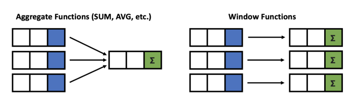
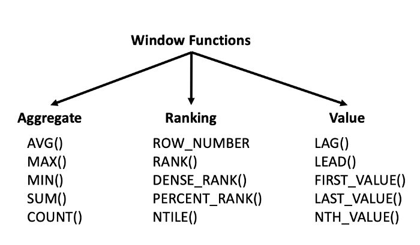

# SQL Window functions notes


## LearnSQL.com cheat sheet

https://learnsql.com/blog/sql-window-functions-cheat-sheet/


## Towards Data Science: An Easy Guide to Advanced SQL Window Functions

https://towardsdatascience.com/a-guide-to-advanced-sql-window-functions-f63f2642cbf9

> One major advantage of window functions is that it allows you to work with both aggregate and non-aggregate values all at once because the rows are not collapsed together.
>
> Window functions are also simple to use and read. That is, they can reduce the complexity of your queries, which makes it easier to maintain down the road.
>
> In addition, they can help with performance issues. For example, you can use a window function instead of having to do a self-join or cross-join.

window functions are allowed in SELECT and ORDER BY, but they are **not** allowed in FROM, WHERE, GROUP BY, or HAVING clauses (because these come before in the order of execution)





#### Create a new column that calculates average Unit Price for each CustomerId

```sql
SELECT CustomerId, 
       UnitPrice, 
       AVG(UnitPrice) OVER (PARTITION BY CustomerId) AS “AvgUnitPrice”
FROM [Order] 
INNER JOIN OrderDetail ON [Order].Id = OrderDetail.OrderId
```

#### Create a new column that calculates average Unit Price for each group of CustomerId AND EmployeeId

```sql
SELECT CustomerId, 
       EmployeeId, 
       AVG(UnitPrice) OVER (PARTITION BY CustomerId, EmployeeId) AS       “AvgUnitPrice”
FROM [Order] 
INNER JOIN OrderDetail ON [Order].Id = OrderDetail.OrderId
```

#### Create a new column that ranks Unit Price in descending order for each CustomerId

- using ROW_NUMBER

  ```sql
  SELECT CustomerId, 
         OrderDate, 
         UnitPrice, 
         ROW_NUMBER() OVER (PARTITION BY CustomerId ORDER BY UnitPrice DESC) AS “UnitRank”
  FROM [Order] 
  INNER JOIN OrderDetail 
  ON [Order].Id = OrderDetail.OrderId
  ```

- using RANK: if you have multiple values with the exact same value, the rank function will give them the same rank, example 1, 2, 2, 4, 5, ...
- using DENSE_RANK: same as RANK, except there are no gaps, example 1, 2, 2, 3, 4, ...
- PERCENT_RANK and NTILE are of the same type

#### Create a new column that provides the previous order date’s Quantity for each ProductId

```sql
SELECT ProductId, 
       OrderDate, 
       Quantity, 
       LAG(Quantity) OVER (PARTITION BY ProductId ORDER BY OrderDate) AS "LAG"
FROM [Order] 
INNER JOIN OrderDetail ON [Order].Id = OrderDetail.OrderId
```

> we get a column with the previous OrderDate’s Quantity. This is really useful because we could compare the current order date to the previous order date and calculate the differences across the two time periods

#### Create a new column that provides the following order date’s Quantity for each ProductId

```sql
SELECT ProductId, 
       OrderDate, 
       Quantity, 
       LEAD(Quantity) OVER (PARTITION BY ProductId ORDER BY OrderDate) AS "LEAD"
FROM [Order] 
INNER JOIN OrderDetail ON [Order].Id = OrderDetail.OrderId
```

#### Create a new column that provides the very first Quantity ever ordered for each ProductId

```sql
SELECT ProductId, 
       OrderDate, 
       Quantity, 
       FIRST_VALUE(Quantity) OVER (PARTITION BY ProductId ORDER BY OrderDate) AS "FirstValue"
FROM [Order] 
INNER JOIN OrderDetail ON [Order].Id = OrderDetail.OrderId
```

#### Using the `frame_clause`

Syntax: `ROWS BETWEEN <starting_row> AND <ending_row>`

- `UNBOUNDED PRECEDING` — all rows before the current row in the partition, i.e. the first row of the partition
- `[some #] PRECEDING` — # of rows before the current row
- `CURRENT ROW` — the current row
- `[some #] FOLLOWING` — # of rows after the current row
- `UNBOUNDED FOLLOWING` — all rows after the current row in the partition, i.e. the last row of the partition

Examples:

- `ROWS BETWEEN 3 PRECEDING AND CURRENT ROW`  this means look back the previous 3 rows up to the current row
- `ROWS BETWEEN UNBOUNDED PRECEDING AND 1 FOLLOWING`  this means look from the first row of the partition to 1 row after the current row
- `ROWS BETWEEN 5 PRECEDING AND 1 PRECEDING`  this means look back the previous 5 rows up to 1 row before the current row
- `ROWS BETWEEN UNBOUNDED PRECEDING AND UNBOUNDED FOLLOWING`  this means look from the first row of the partition to the last row of the partition

**IMPORTANT**: anytime that you add an **ORDER BY** clause, SQL sets the **default window** as **ROWS BETWEEN UNBOUNDED PRECEDING AND CURRENT ROW** which means the window shows rows **"up until the current row"** *note: probably better to specify it in the code, for clarity of intent.*

#### Calculate a cumulative moving average UnitPrice for each CustomerId

```sql
SELECT CustomerId, 
       UnitPrice, 
       AVG(UnitPrice) OVER (PARTITION BY CustomerId 
       ORDER BY CustomerId 
       ROWS BETWEEN UNBOUNDED PRECEDING AND CURRENT ROW) AS “CumAvg”
FROM [Order]
INNER JOIN OrderDetail ON [Order].Id = OrderDetail.OrderId
```


## Mode.com: SQL Tutorial - SQL Window Functions

https://mode.com/sql-tutorial/sql-window-functions/

#### Running total

`SUM(column) OVER (ORDER BY other_column)` will compute the sum for all rows up to the current one

```sql
SELECT duration_seconds,
       SUM(duration_seconds) OVER (ORDER BY start_time) AS running_total
  FROM tutorial.dc_bikeshare_q1_2012
```

#### Running total, partitioned

for each row, the window will only present the values that match the one in the SELECT clause

```sql
SELECT start_terminal,
       duration_seconds,
       SUM(duration_seconds) OVER
         (PARTITION BY start_terminal ORDER BY start_time)
         AS running_total
  FROM tutorial.dc_bikeshare_q1_2012
```

#### Running aggregates

```sql
SELECT start_terminal,
       duration_seconds,
       SUM(duration_seconds) OVER
         (PARTITION BY start_terminal) AS running_total,
       COUNT(duration_seconds) OVER
         (PARTITION BY start_terminal) AS running_count,
       AVG(duration_seconds) OVER
         (PARTITION BY start_terminal) AS running_avg
  FROM tutorial.dc_bikeshare_q1_2012
```

#### Percentiles

```sql
SELECT start_terminal,
       duration_seconds,
       NTILE(4) OVER
         (PARTITION BY start_terminal ORDER BY duration_seconds)
          AS quartile,
       NTILE(5) OVER
         (PARTITION BY start_terminal ORDER BY duration_seconds)
         AS quintile,
       NTILE(100) OVER
         (PARTITION BY start_terminal ORDER BY duration_seconds)
         AS percentile
  FROM tutorial.dc_bikeshare_q1_2012
```

#### LAG and LEAD

```sql
SELECT start_terminal,
       duration_seconds,
       duration_seconds - LAG(duration_seconds, 1) OVER
         (PARTITION BY start_terminal ORDER BY duration_seconds)
         AS difference
  FROM tutorial.dc_bikeshare_q1_2012
```

The first row of the difference column is null because there is no previous row from which to pull. Similarly, using LEAD will create nulls at the end of the dataset

#### Defining a window alias

for readability

```sql
SELECT start_terminal,
       duration_seconds,
       NTILE(4) OVER ntile_window AS quartile,
       NTILE(5) OVER ntile_window AS quintile,
       NTILE(100) OVER ntile_window AS percentile
  FROM tutorial.dc_bikeshare_q1_2012
WINDOW ntile_window AS
         (PARTITION BY start_terminal ORDER BY duration_seconds)
```

#### Full documentation

https://www.postgresql.org/docs/14/functions-window.html


## LearnSQL.com: SQL Window Function Example

https://learnsql.com/blog/sql-window-functions-examples/

```sql
SELECT	
		RANK() OVER (PARTITION BY department ORDER BY salary DESC) 
			AS dept_ranking,
		department,
		employee_id, 
		full_name, 
		salary
FROM employee;
```

```sql
SELECT
  employee_id, 
  full_name, 
  department,
  salary,
  salary / MAX(salary) OVER (PARTITION BY department ORDER BY salary DESC) 
    AS salary_metric
FROM employee
ORDER BY 5;
```

```sql
SELECT 
	train_id, 
	station,
	time as "station_time",
	lead(time) OVER (PARTITION BY train_id ORDER BY time) - time 
		AS time_to_next_station
FROM train_schedule;
```

```sql
SELECT 	
	train_id, 
	station,
	time as "station_time",
	time - min(time) OVER (PARTITION BY train_id ORDER BY time) 	
								AS elapsed_travel_time,
	lead(time) OVER (PARTITION BY train_id ORDER BY time) - time 
								AS time_to_next_station
FROM train_schedule;
```

